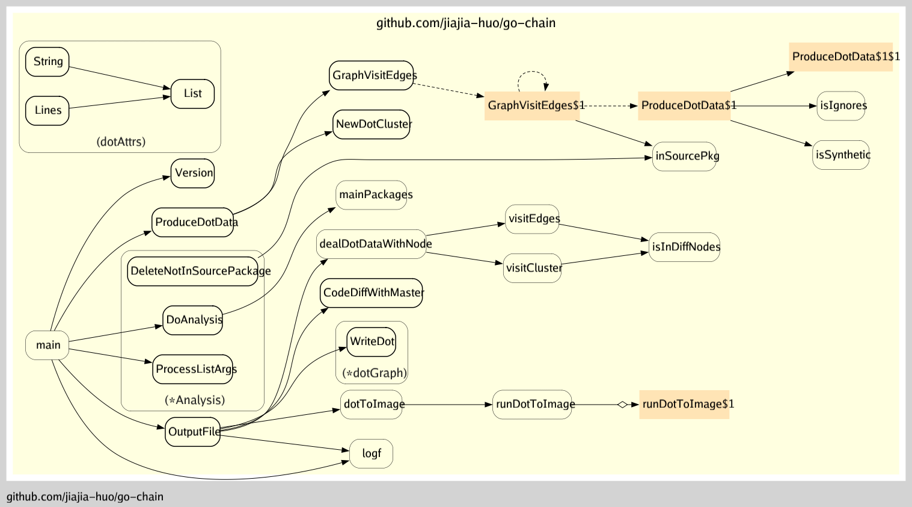

# go-chain

## 安装
```sh
go get -u github.com/jiajia-huo/go-chain
```

### 使用
```
Usage of go-chain:
  -debug
        debug日志.
  -diff
        和master对比，只输出变动涉及到的func相关链路.
  -f string
        给定函数名字分析，逗号分割。和diff参数互斥
  -file string
        输出文件名字 (default "output")
  -format string
        输出文件格式 [svg | png | jpg | ...] (default "svg")
  -ignore string
        忽略 package paths 前缀或者后缀字符串,逗号分割
  -otherPackage string
        添加其他package,逗号分割，例如sdk:github.com/xxx/xxx/xxx/...
  -version
        Show version and exit.

```
## 项目架构



## 例子
```
#获取项目整体调用链，输出svg文件
go-chain -file=file_name -format=svg

#获取当前分支和master对比后变动的函数的调用链
go-chain -file=file_name -format=svg -diff

#获取指定函数名字的调用链
go-chain -file=file_name -format=svg -f=GetLayerConfig,load,store

#获取包含第三方sdk的的调用链
go-chain -file=file_name -format=svg -otherPackage=github.com/xxx/xxx/xxx/...

#忽略指定前缀或者后缀的package
go-chain -file=file_name -format=svg -ignore=.pb,xxx/traffic

```
